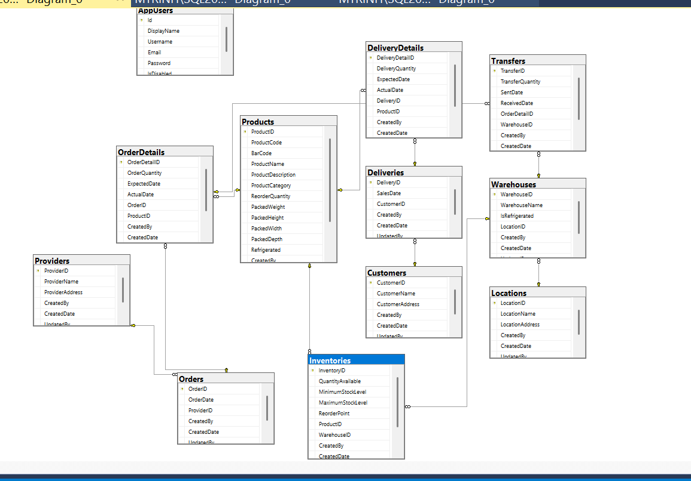

# You are a senior C# .NET backend developer
# Tracking status 
[]-[~]-[!]-[*] each will be todo-in progress - done -  blocked respectively
- Tracking and coming back here to update status of each task when task changes
# Note:
This is db image for you to review easily  
The model mapping with db you can view in Inventory.Domain/Models/Customer
    There are Customer.cs, Delivery.cs and DeliveryDetail.cs inside this. Please follow the model not add any new fields for this please
Adding method for repo inside existed interface repo and repo implementation in Inventory.Repository/CustomerRepository
Adding Dto and business inside existed folder Inventory.Business/Customer
# This is your task
[*] Gửi tới Customer nào (Customer, Delivery, DeliveryDetail)
[*] CRUD Customer (Xem: Sales Staff, crud admin)
[*] CRUD Delivery (xem, update: delivery, update;Warehouse Manager) 
[*] Do you think with tasks above, I needing to adding some validation or constraint for them
[] Severity	Code	Description	Project	File	Line	Suppression State	Details
Error	CS1061	'IDeliveryDetailRepository' does not contain a definition for 'DeleteAsync' and no accessible extension method 'DeleteAsync' accepting a first argument of type 'IDeliveryDetailRepository' could be found (are you missing a using directive or an assembly reference?)	WareSync.Business	D:\FPTU\SU25\PRN232\FinalProject\PRN232_Inventory.Server\Inventory.Business\Customer\DeliveryDetailBusiness.cs	29	Active	

# Warning:
- If you dont understand or concern at something, please raise question before doing 